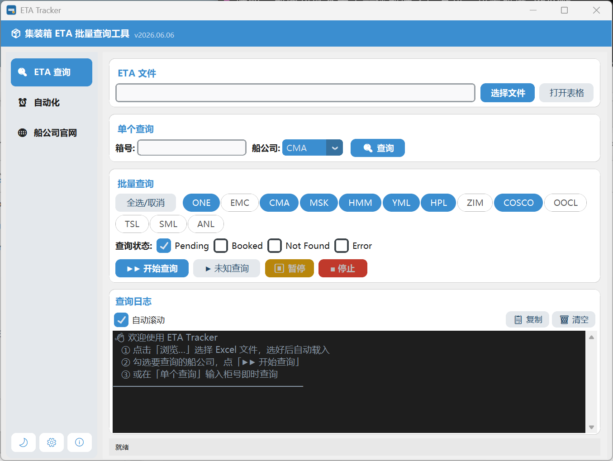
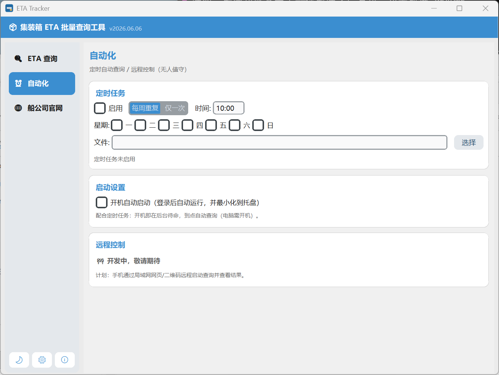
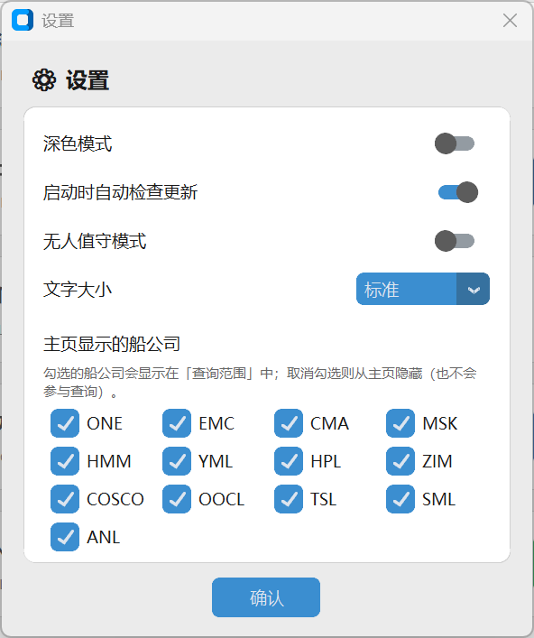
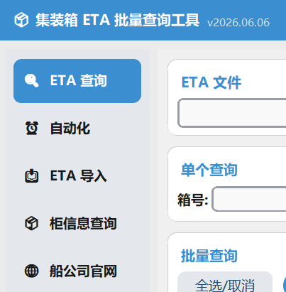

# ETA Tracker

批量查询集装箱 ETA（预计到港时间）并写回 Excel 的 Windows 桌面工具。支持多家船公司官网自动查询、列自动识别、定时任务与系统托盘常驻。

## 📷 界面预览

**ETA 查询主界面**

**自动化（定时任务 / 开机自启）**

## ✨ 主要功能

### ETA 查询
- **批量查询**：导入 Excel / CSV（柜号清单）后，自动按船公司分组查询 ETA / 船公司 / 目的港，结果写回 `.xlsx`。
- **智能批量提速**：对原生支持多箱的船公司（COSCO / HMM / YML / SML / OOCL）自动合并请求，查询更快、请求更少、验证码更少。
- **支持船公司（13 家）**：ONE、Evergreen(EMC)、CMA CGM、Maersk(MSK)、HMM、Yang Ming(YML)、Hapag-Lloyd(HPL)、ZIM、COSCO、OOCL、SM Line(SML)、Emirates(ESL)、SITC。
- **单个查询**：输入单个柜号即时查询。
- **未知船公司轮询**：未标注船公司的柜号，自动用已选船公司逐一尝试识别。
- **ETA 差异高亮**：与旧 ETA 对比，按提前 / 正常 / 延误（橙/红）着色，一眼看出变化。

### 文件兼容（通用方案）
- 同时支持 **`.xls`、`.xlsx`、`.csv`** 输入，输出统一为彩色 `.xlsx`。CSV 自动识别编码（UTF-8 / GBK 等）与分隔符（逗号 / 分号 / 制表符）。
- **列自动识别**：按表头名 + 内容特征自动定位柜号 / ETA / 船公司 / 目的港列。
- **手动列映射**：识别不准时弹窗让你指定列，并**按表头指纹记住该格式**，同格式下次自动套用。

### 自动化
- **定时任务**：每周重复（选星期 + 时间）或仅一次（选日期 + 时间），到点自动加载指定文件并查询。
- **顺延执行**：到点若有查询正在进行，等其完成后自动补跑。
- **系统托盘常驻**：关闭窗口最小化到托盘，后台继续运行，定时任务不中断。
- **安全验证提醒**：需人工完成验证码 / 安全验证时，托盘气泡 + 提示音提醒。
- **开机自启**（可选）：登录后自动运行并最小化到托盘。
- **单实例保护**：避免重复启动导致重复查询 / 写文件冲突。

### 个性化设置
- **显示的船公司**：自定义主页显示哪些船公司，拖拽排序。
- **界面**：深色 / 浅色模式、文字大小调节。

### 按需定制
可根据实际业务需求，定制查询流程与界面功能（例如新增专属数据页签、对接特定内部系统流程）。下图为示例：在基础功能之外扩展出的专属页签。

### 其他
- **在线更新**：通过 GitHub Releases 自动检测并更新到最新版。

## 🚀 使用方法

1. 从 [Releases](https://github.com/lll325/eta-tracker/releases/latest) 下载最新的 `ETA Tracker.exe`。
2. 双击运行（首次启动会解压，稍候几秒）。
3. 在「ETA 查询」页选择 Excel / CSV 文件 → 勾选要查询的船公司 → 点「▶▶ 开始查询」。
4. 查询结果写入同目录的 `ETA_<原文件名>.xlsx`。

### 定时自动查询
1. 进入「⏰ 自动化」页，勾选「启用」。
2. 选模式（每周重复 / 仅一次）、设置时间与文件。
3. 勾选「开机自动启动」可实现开机后台待命、到点自动查询。

> ⚠️ 部分船公司（如 CMA、Maersk、OOCL、ESL）查询时可能触发安全验证 / 验证码，需人工在浏览器中完成。无人值守场景建议优先使用接口类船公司（ONE / EMC / COSCO / SITC）。

## 💻 运行环境
- Windows 10 / 11（64 位）
- 需安装 Microsoft Edge（Selenium 类船公司查询依赖 Edge 浏览器）

## 📦 版本
当前版本：**v2026.06.08**

更新历史见 [Releases](https://github.com/lll325/eta-tracker/releases)。
